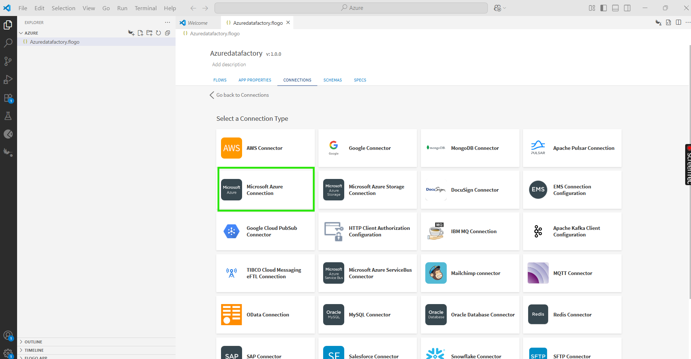
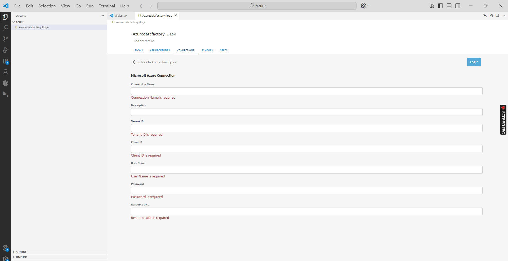
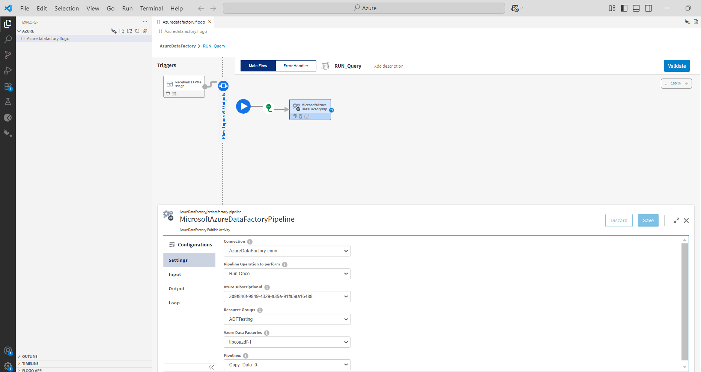
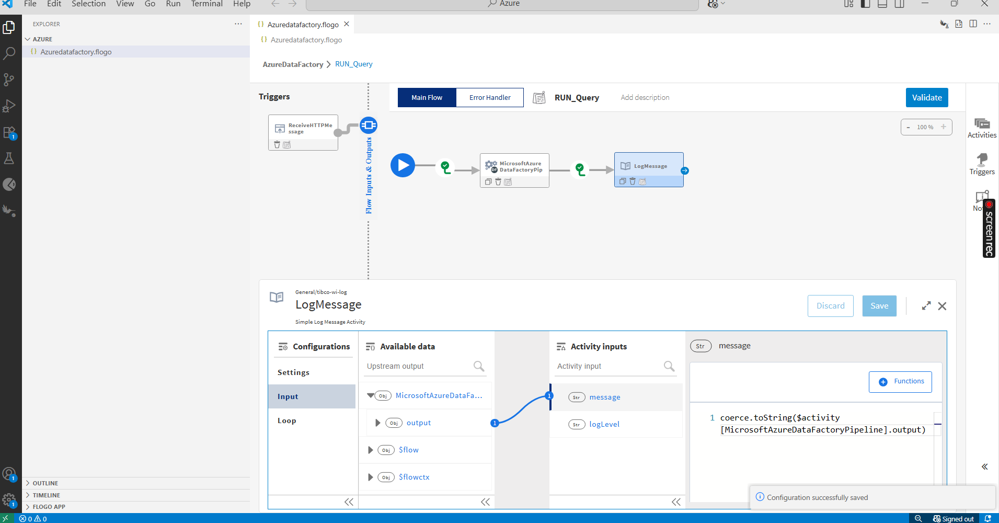
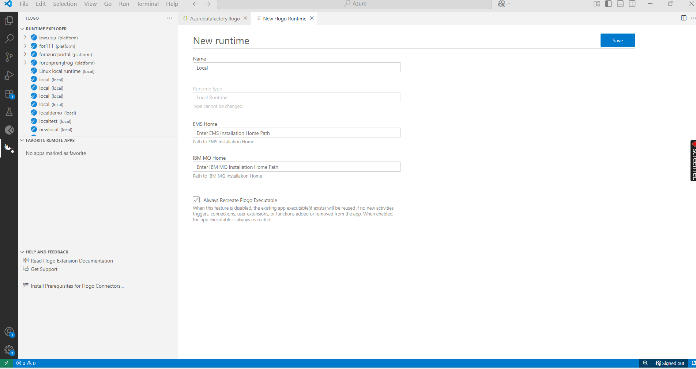
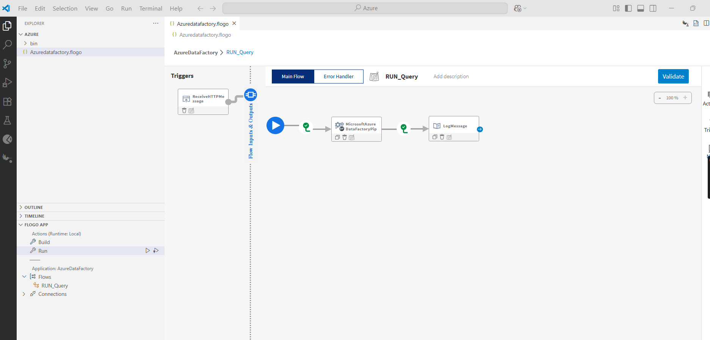
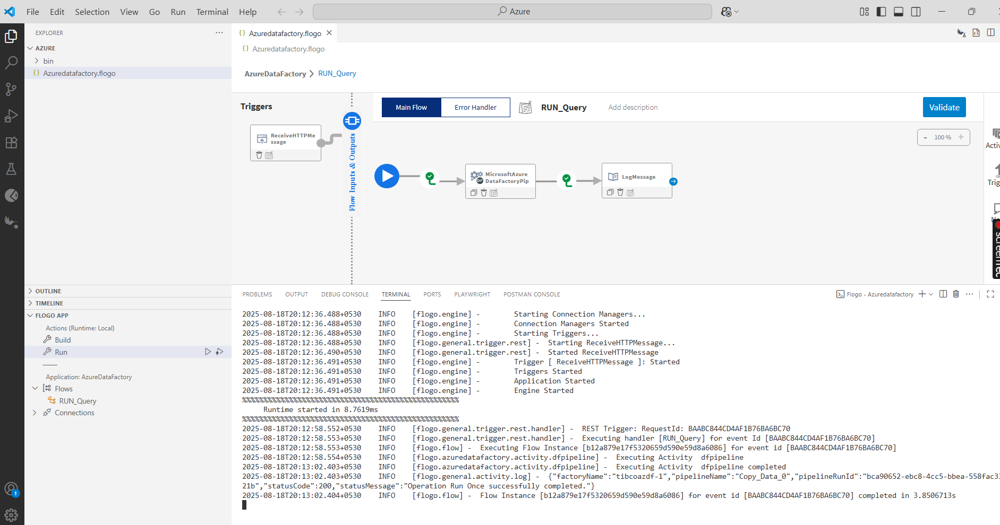
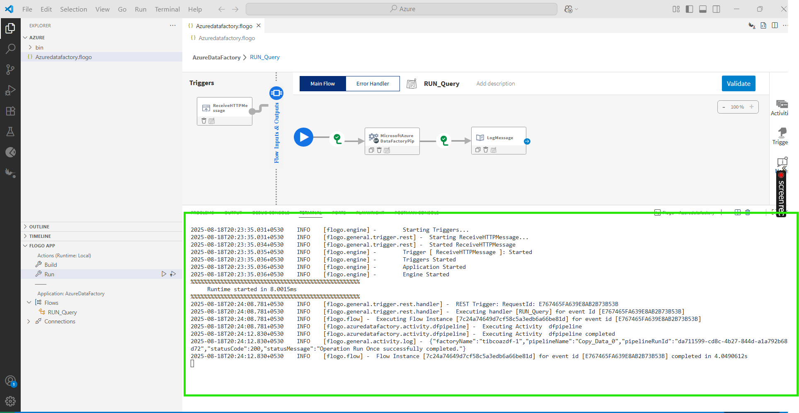

# AzureDataFactory Sample

## Description
Azure Data Factory (ADF) is a cloud-based data integration and orchestration service provided by Microsoft Azure. It allows you to create, schedule, and manage data pipelines that move and transform data from various sources to destinations, typically for analytics and big data scenarios.
This examples shows how we can create and use the 'AzureDataFactory' activity.
AzureDataFactory app bascially contain 2 activity (MicrosoftAzureDatafactoryPipeline,LogMessage)

The main purpose of the sample is:
* To copy the data using 'MicrosoftAzureDatafactoryPipeline'.

## Prerequisites

1. Ensure that you have access of Azure portal.
2. To execute the Azure Data Factory app we require the Resource Group name, Azure Datafactory name, Pipeline name from the Azure portal.
  

## Create AzureDataFactory Application

1. Install TIBCO Flogo Extention for Visual Studio Code and Create new flogo app in it. 

2. In newly created flogo app go to CONNECTIONS > Create Connection > Microsoft Azure connection.

3. Configure Microsoft Azure connection details and click on Login button to save the connection.

For Creating the connection we need data for below fields.

a. Connection Name - In this field we give the connection name.  
b. Tenant Id - For Tenant Id goto to the app registration from Azure portal then select your  account and then copy the Tenant Id.  
c. Client Id - For Client Id goto to the app registration from Azure portal then select  your account and then copy the Client Id.  
d. User Name - Add the User name.  
e. Password -  Add the Password of the user.

f. Resource Group- Need to pass the resource group name as "https://management.azure.com".

4. Now go to FLOWS tab and add Receive HTTP Message trigger and configure it.

5. Add and configure 'MicrosoftAzureDatafactoryPipeline' Activity.

6. Now add and configure the LogMessage activity.

### The Flow

* If you go inside the app, there are 2 activities (MicrosoftAzureDataFactoryPipeline,LogMessageActivity) that perform copy operations like: Copy the data from source to destination.
* In 'MicrosoftAzureDataFactoryPipeline' activity we have selected the 'Pipeline Operation to performs' as 'Run Once' it means it will run only one time, after that we have selected the 'Resource Group' as 'ADFTesting' and then we have selected the 'AzureDataFactories' name  and finally we have selected the name of pipeline name as 'Copy_Data_0'.
* In flow we have Log Message Activities for every MicrosoftAzureDataFactoryPipeline activity output.

### Run the application

For running the application, 
1. First you have to add local runtime in Visual Studio Code.

2. Select added local runtime for your Flogo AzureDataFacoty application.

3. Now Build your Flogo AzureDataFacoty app.

4. Once build is successfull you can see the binary in bin folder.

5. Now Run the AzureDataFactory flogo app. 

6. After running app hit the endpoint and see the results.

7. After endpoint hit you will able to see the logs in VS code terminal.

## Outputs

1. Verify output in VS code terminal

## Troubleshooting

* If you see test connection failed for `Login`, then check for your passoword is correct or not.
