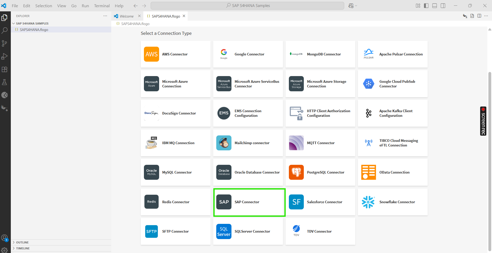
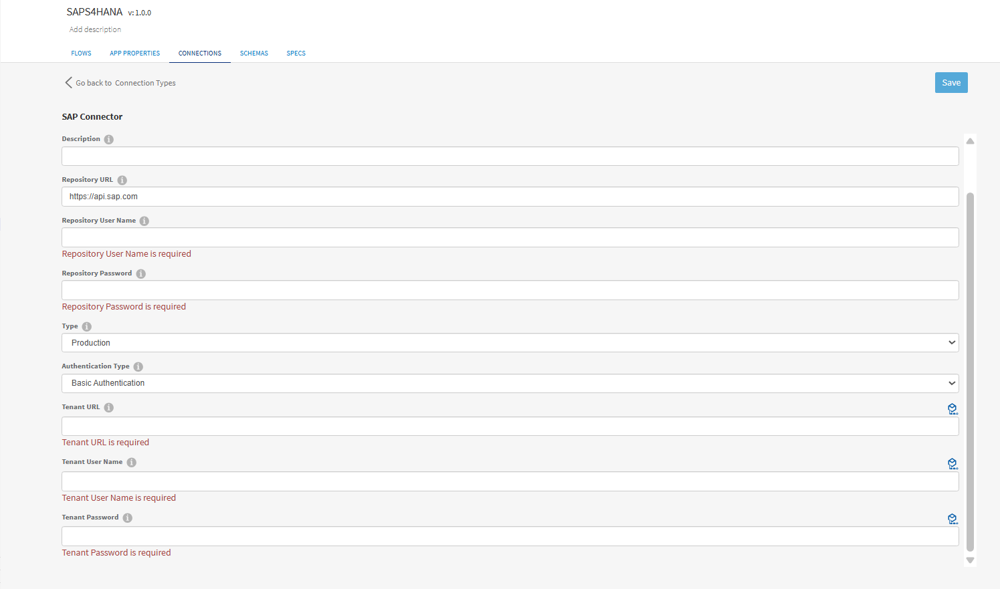
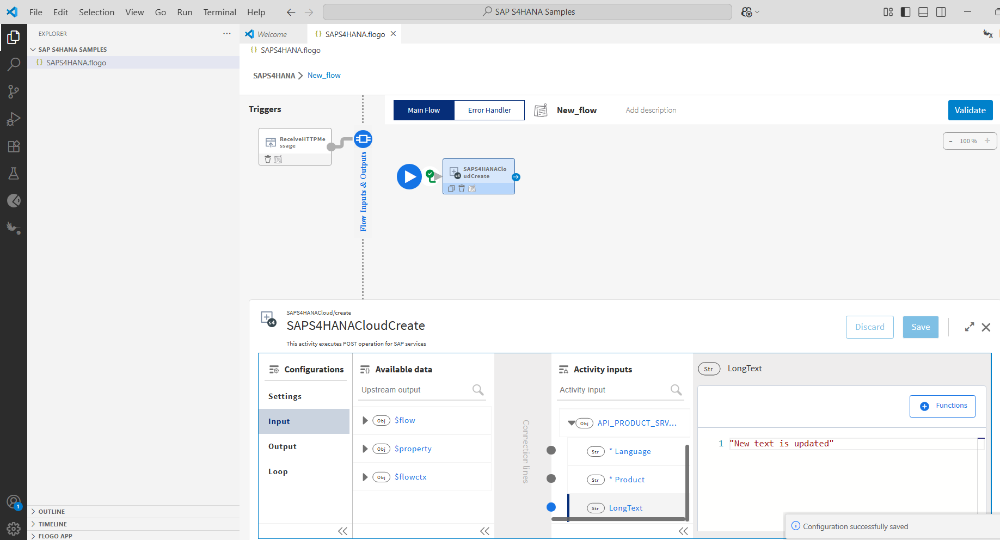
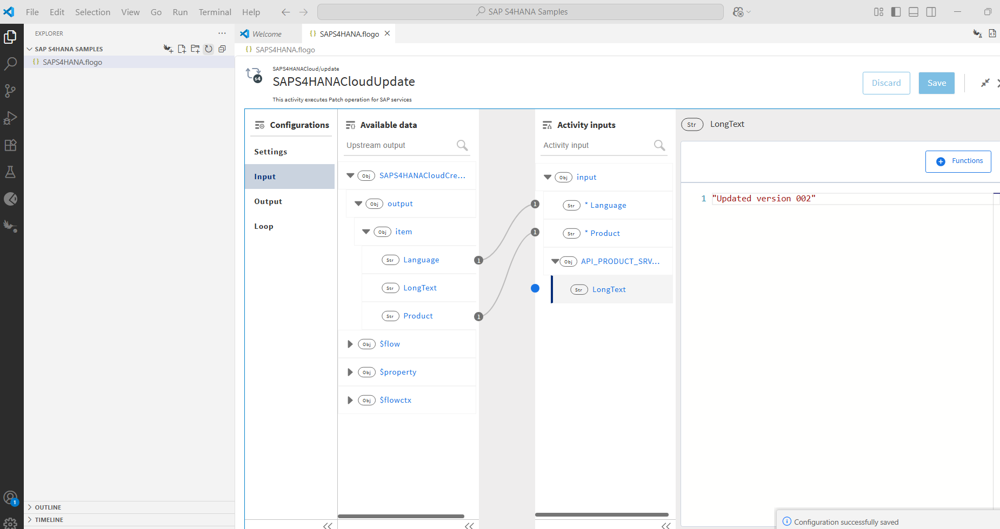
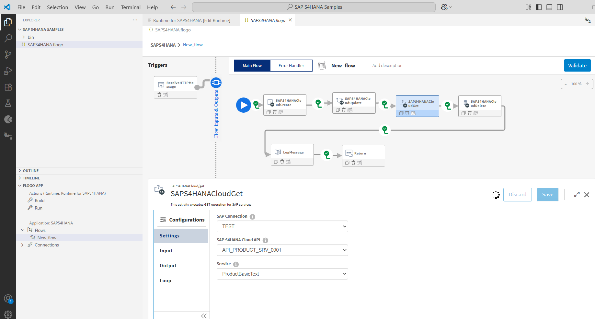
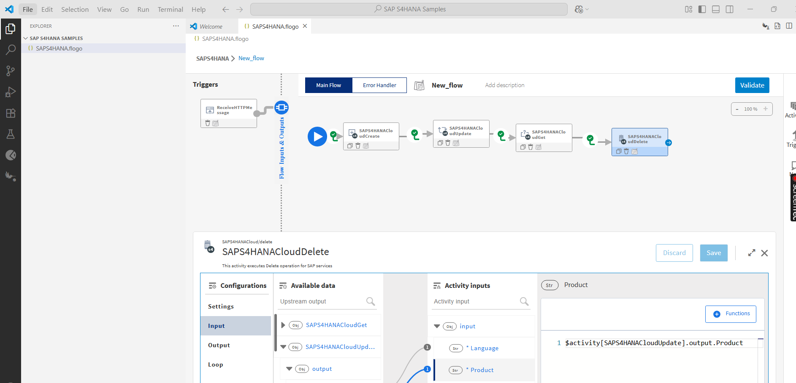
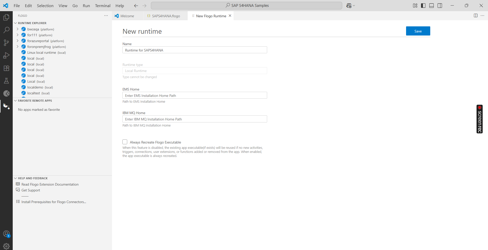
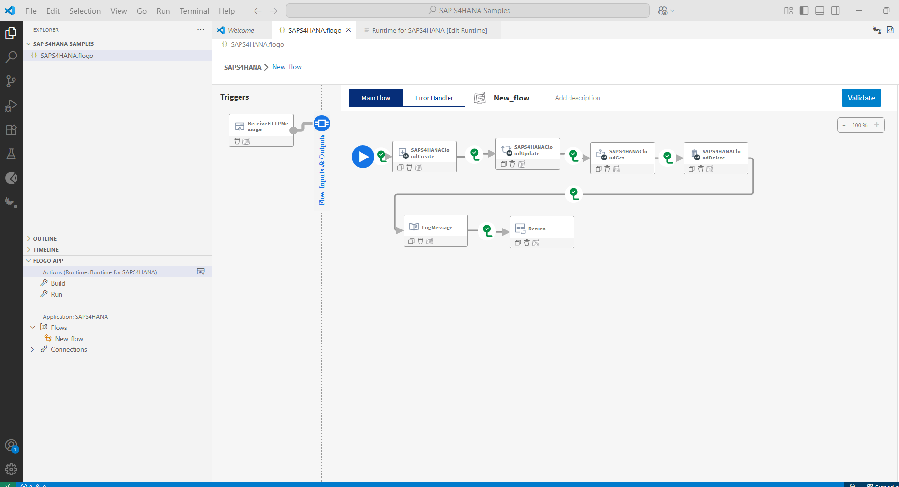
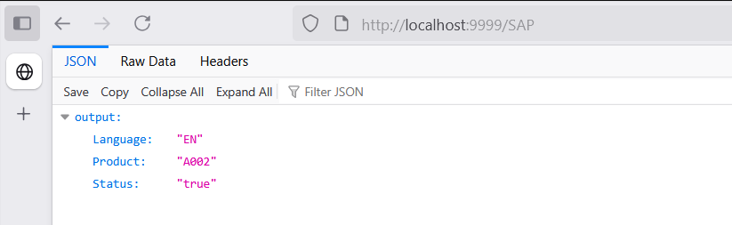
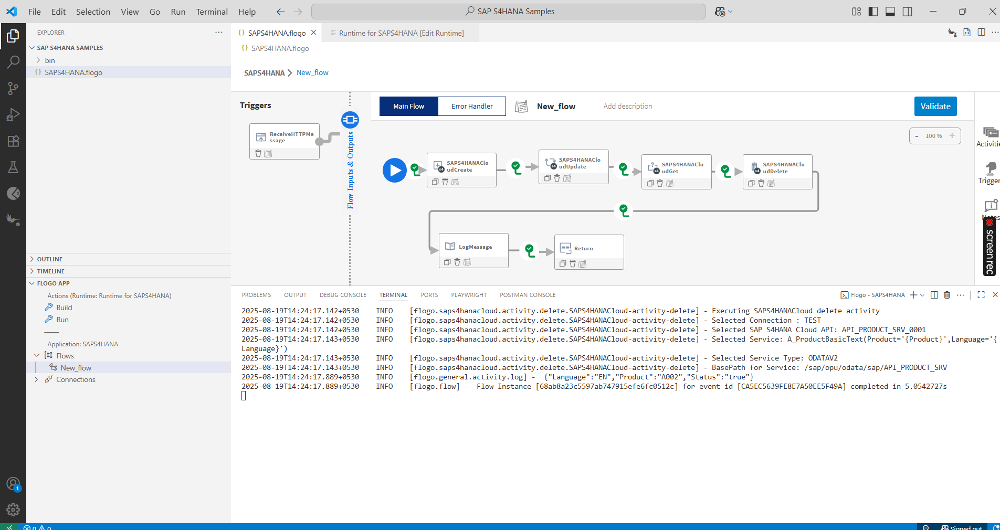

# SAPS4HANA Example

## Description
SAP S/4HANA (SAP Business Suite 4 SAP HANA) is an integrated enterprise resource planning (ERP) system developed by SAP SE. It's the next-generation ERP system that runs exclusively on SAP's in-memory database.The features are like 'Allows real-time processing and analytics','Much faster than traditional disk-based databases.'

Below example demonstrates how we can create and use SAP S4HANA provide activities.
SAP S4HANA app bascially contain 5 activities. 

The main purpose of these activities are:
* To insert data using 'SAPS4HANACloudCreate' activity.
* To fetch data using 'SAPS4HANACloudGet' activity.
* To Update the data using 'SAPS4HANACloudUpdate' activity.
* To Delete the data using 'SAPS4HANACloudDelete' activity.

## Prerequisites

1. User should have the valid credentials of api.sap.com

## Create SAP S4HANA Application

1. Install TIBCO Flogo Extention for Visual Studio Code and Create new flogo app in it. 

2. In newly created flogo app go to CONNECTIONS > Create Connection > SAP Connector.

3. Configure SAP connection details and click on Connect button to save the connection.

Below details are required to create the SAP S4HANA Connection

 a. Repository URL - In this field we need give url of sap api(api.sap.com).   
 b. Repository Password - In this field we need to pass the password of sap account.   
 c. Type - For this field we have 2 drop down values like 'Production and sandbox', for sandbox we can use only the  'SAPS4HANACloudGet'.  
 d. Authenticate Type- Select the authentication type as 'Basic Authentication or SSL Client certificate'.          
 e. Tenant URL - Pass the tenant url.   
 f. Tenant User Name - Specify the tenant user name.  
 g. Tenant Password-  specify the tenant password.

4. Now go to FLOWS tab and add Receive HTTP Message trigger and configure it.

5. Add and configure SAPS4HANACloudCreate Activity.
* Using 'SAPS4HANACloudCreate' activity we are adding the 'LongText',for 'Create' activity 'Product' and 'Language' fields are mandatory'.In this example we are creating the product text for product 'A002'

6. Similarly add and configure SAPS4HANACloudUpdate Activity.
* Using SAPS4HANACloudUpdate activity we are updating the 'LongText' for update activity product and Language fields are mandatory.

7. Similarly add and configure SAPS4HANACloudGet Activity.
* Using SAPS4HANACloudGet activity we can retrive the product details or we can also fetch the specific fields.

8. Similarly add and configure SAPS4HANACloudDelete Activity.
* Using SAPS4HANACloudDelete activity we are deleting the product long text, for this 'Product' and 'Language' fields are mandatory.

### Run the application

For running the application, 
1. First you have to add local runtime in Visual Studio Code.

2. Select added local runtime for your Flogo app.

3. Now Build your Flogo SAP S4HANA app.

4. Once build is successfull you can see the binary in bin folder.

5. Now Run the Flogo SAPS4HANA app. 

6. After running app hit the endpoint and see the results.

7. After endpoint hit you will able to see the logs in VS code terminal.

## Outputs

1. Verify output by hiting the endpoint

2. Verify output in VS code terminal

## Notes and Links:

* We can register the user from api.sap.com, after registring successfully we use the user name and password in our connection details screen.

