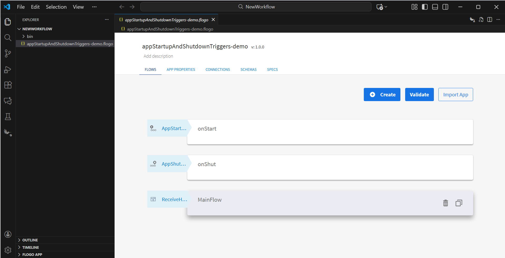
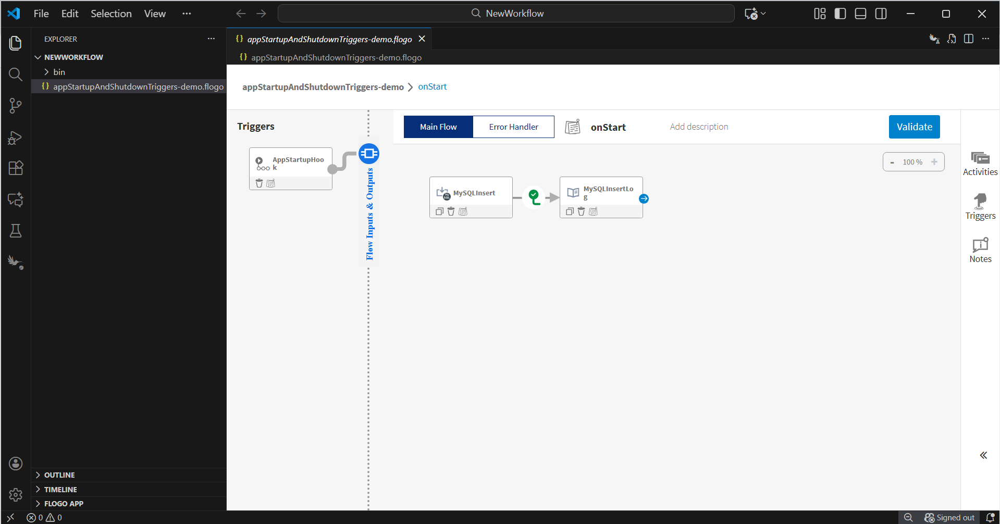
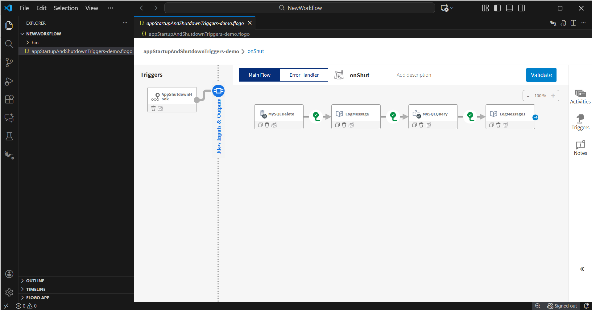
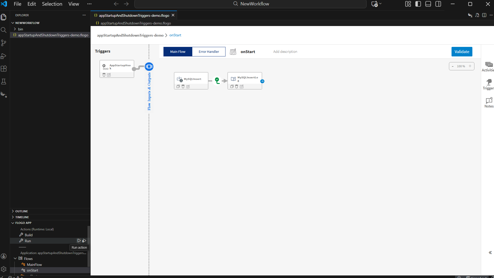
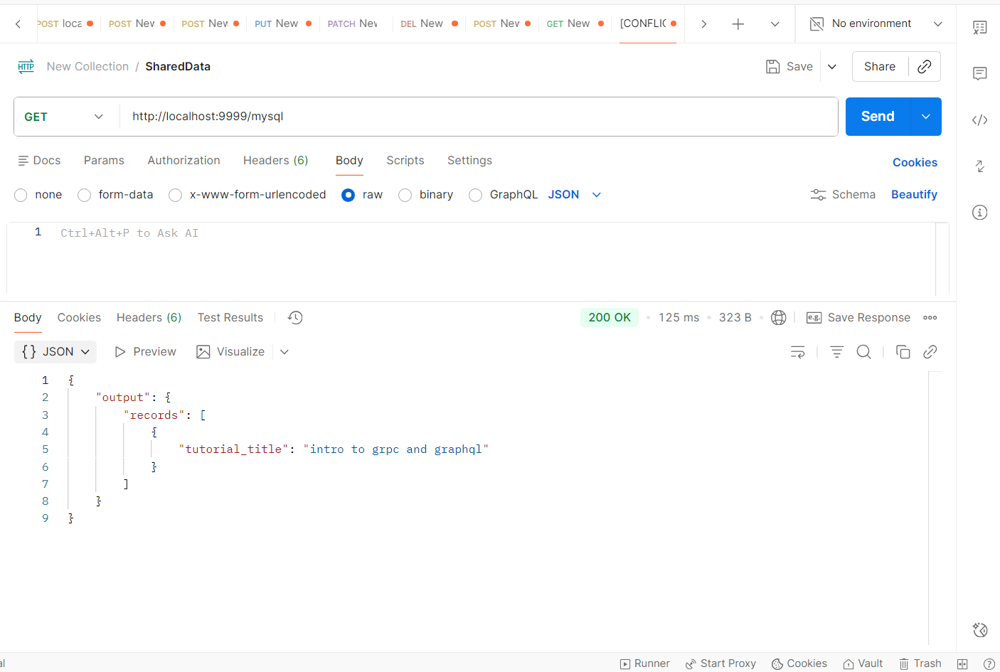
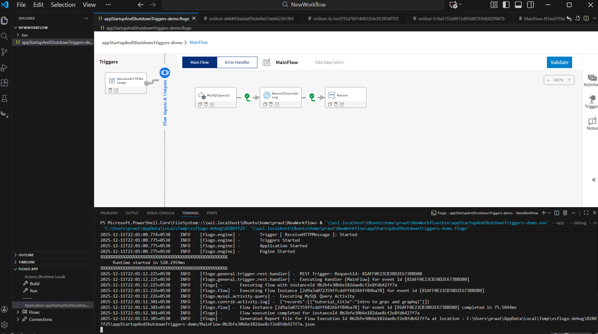
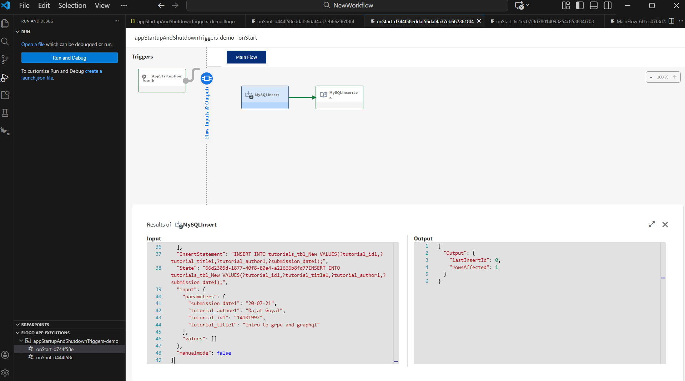
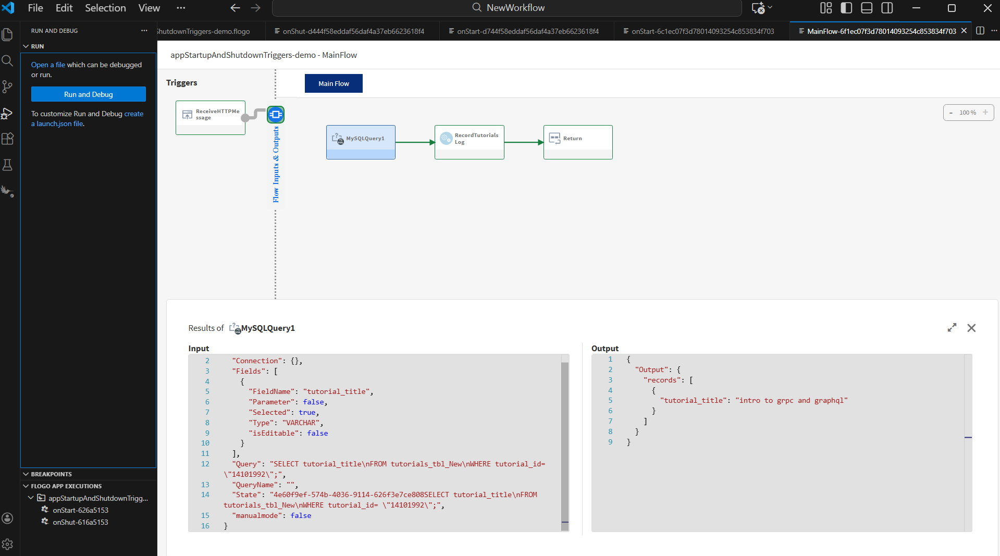
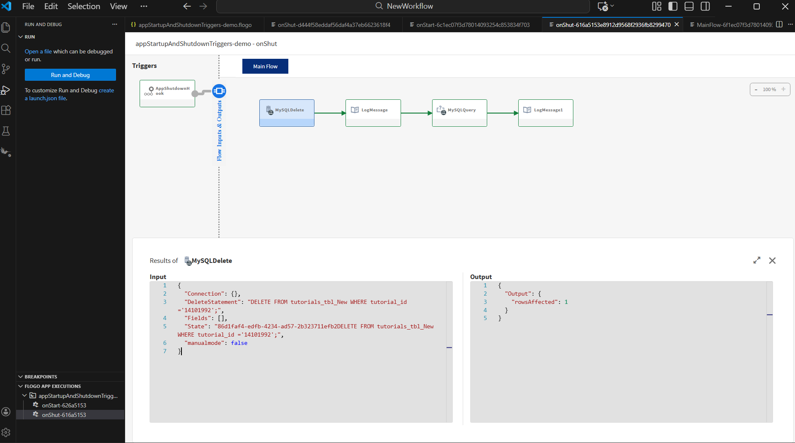
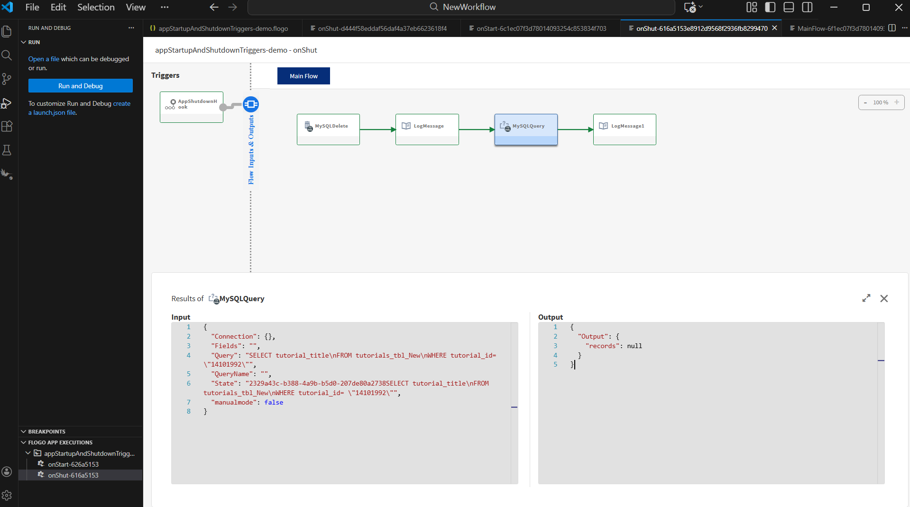

# App Startup and Shutdown Trigger Sample

# Description

This is a sample for the app Startup and Shutdown triggers. The app Startup trigger is invoked before any other triggers in the app start and can be used to specify initialization logic that is specific to the app. The app Shutdown trigger is invoked after all other triggers in the app have successfully stopped. This trigger can be used for cleaning up data (for example, deleting SharedData) or removing tables from a database. In this sample, we insert values into a database table in the app Startup trigger, query that data in the Main Flow, and delete the table in the app Shutdown trigger flow. The database used is MySQL.

### **Note: The app startup and shutdown triggers do not require any configurations.**

## Prerequisite

The MySQL database service is up and running.

## Copy App

1. Copy the appStartupAndShutdownTriggers-demo.flogo app into your workspace. 

## Understanding the configuration

In the attached sample appStartupAndShutdownTriggers-demo.flogo, there is a flow named onStart. This flow is executed before all other triggers in the app start, since it is attached to the appStartup trigger. As soon as the user scales their app, the activities inside the onStart flow are executed. Here, we insert values into the DB table tutorials_tbl_New and log the output of the activity in the flow.

In the second flow, Main Flow, we query the values from the tutorials_tbl_New table using the tutorial_id, use the result to log in the next activity, and return the same values to the trigger via the return activity.

In the third flow, onShut, the flow is executed after all the triggers in the app have stopped, since it is attached to the appShutdown trigger. We delete the values from the tutorials_tbl_New table using the tutorial_id. After that, we query the data using the tutorial_id and receive a null value.

### Run the application

Once you are ready to run the application, use the Run option to start the app.

## Unit Test

1. Flow Tester 	

 

2. When hit endpoints

## Help

Please visit our [App Startup Trigger](https://docs.tibco.com/pub/flogo/latest/doc/html/Default.htm#flogo-all-vsc/app_startup_trigger.htm?TocPath=User%2520Guide%257CApp%2520Development%257CGeneral%2520Category%2520Triggers%252C%2520Activities%252C%2520and%2520Connections%257CTriggers%257C_____6) for additional information.

Please visit our [App Shutdown Trigger](https://docs.tibco.com/pub/flogo/latest/doc/html/Default.htm#flogo-all-vsc/app_shutdown_trigger.htm?TocPath=User%2520Guide%257CApp%2520Development%257CGeneral%2520Category%2520Triggers%252C%2520Activities%252C%2520and%2520Connections%257CTriggers%257C_____7) for additional information.