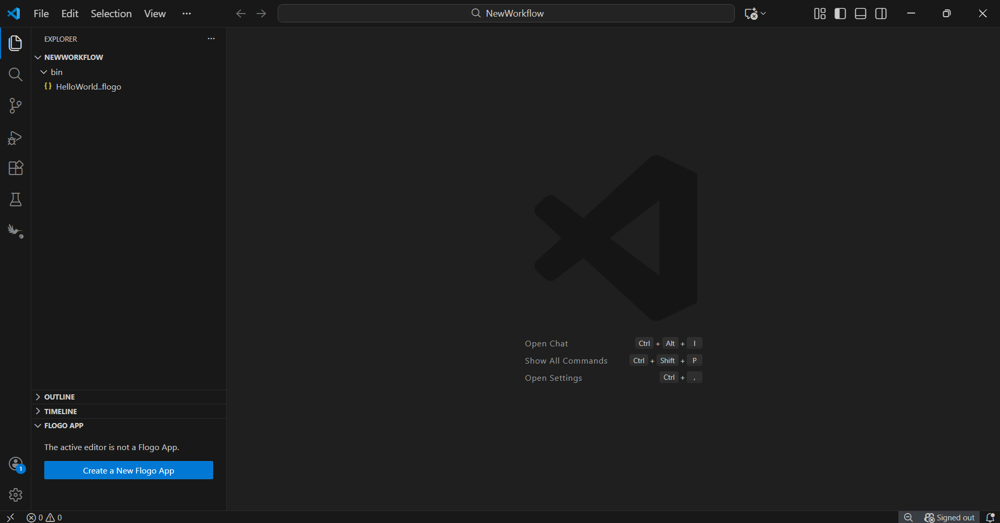
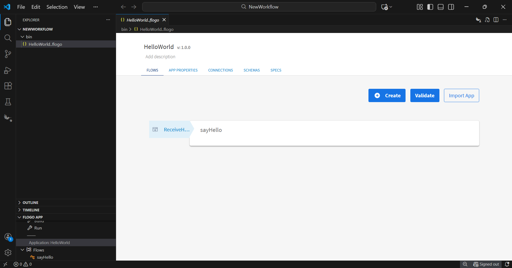
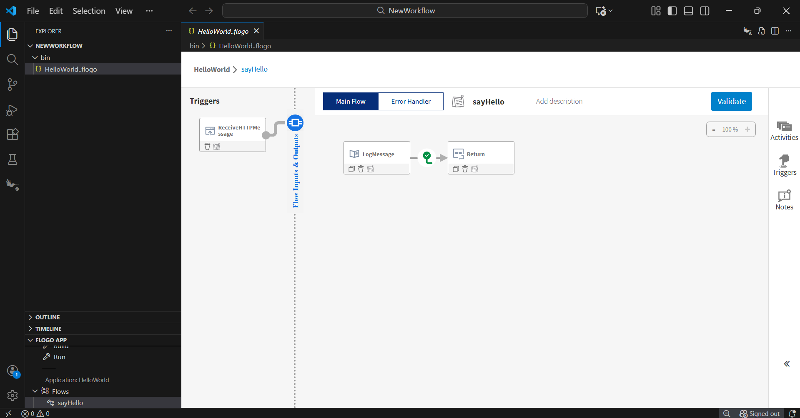
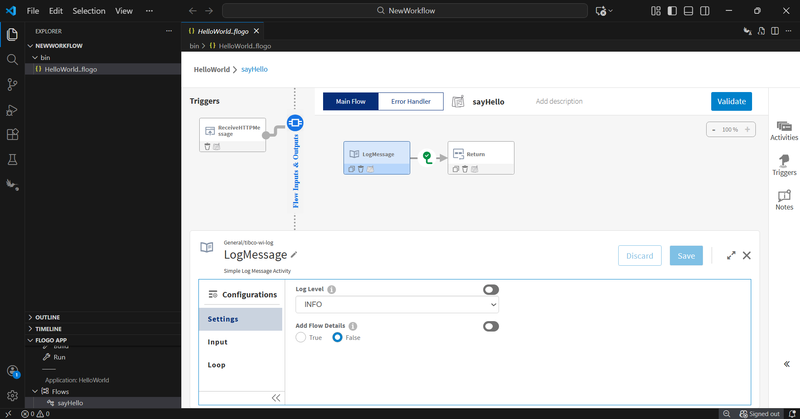
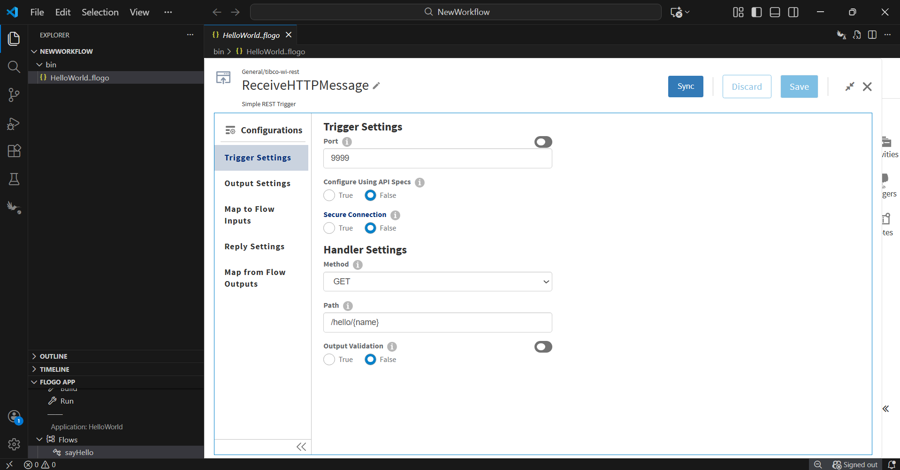
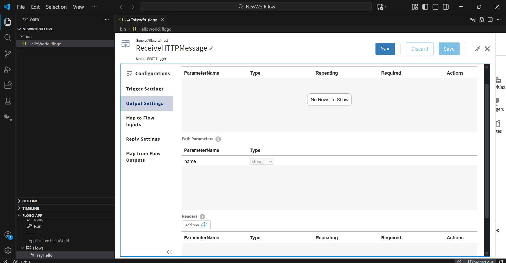
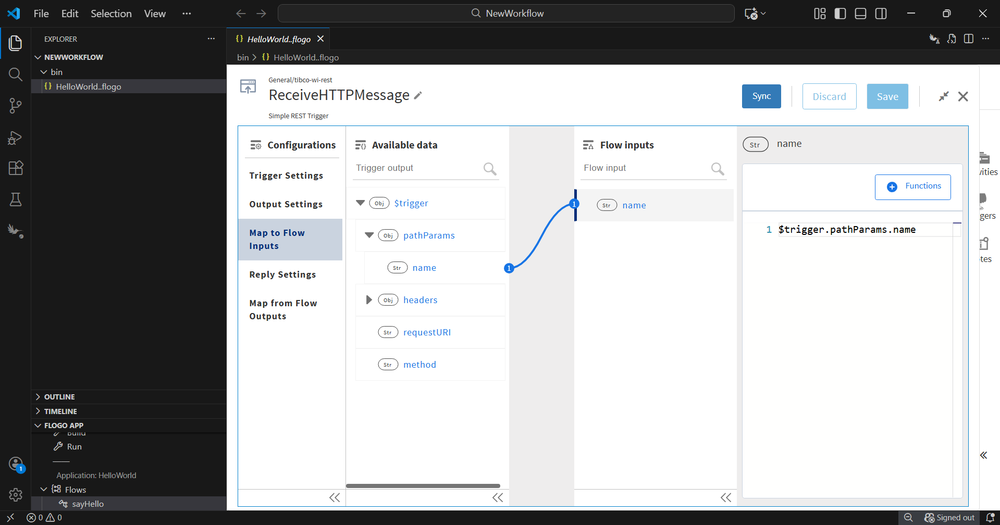
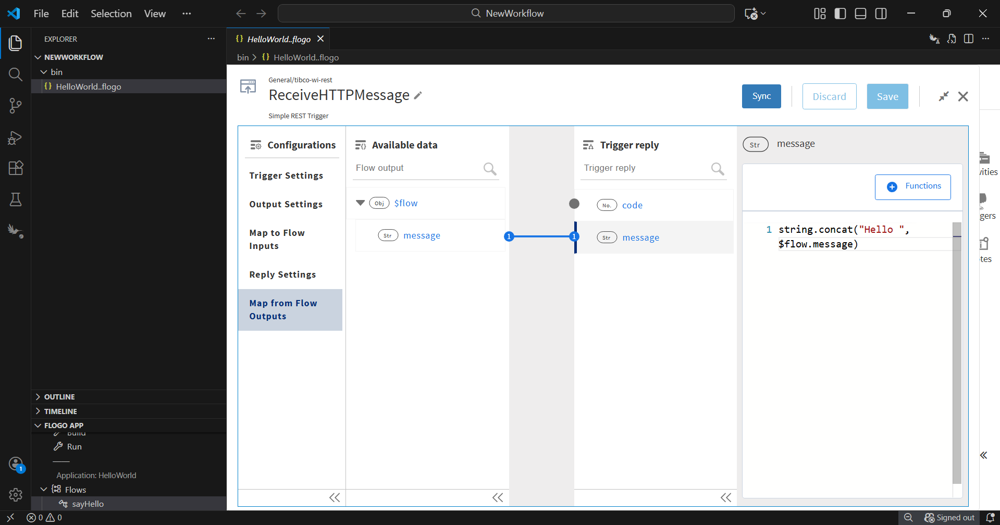
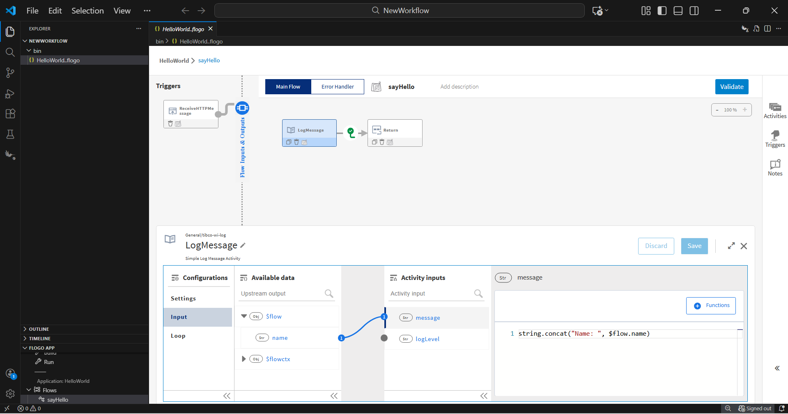
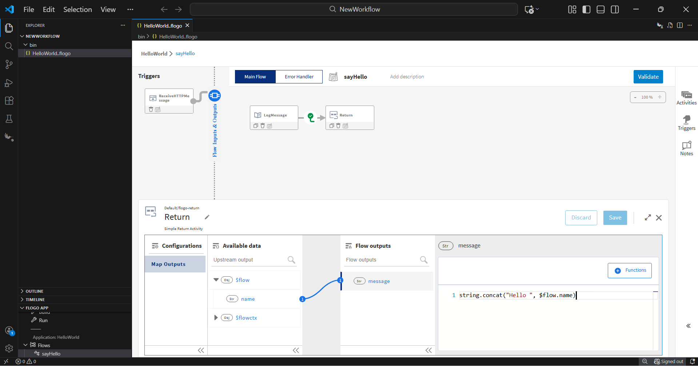

## Hello World Sample

## Copy App 

1. Copy the HelloWorld.flogo app into your workspace.

2. Click on the HelloWorld.flogo app. On the app details page, you can see the sayHello flow. Click the sayHello flow — you’ll see the REST trigger connected to a LogmessageActivity, which in turn is connected to a ReturnActivity. Then click LogmessageActivity — you will see a Configuration tab. Inside the Configuration tab, you will find Settings, Input, and Output sections displayed.

## Understanding the configuration

This sample is a simple Flogo app that prints and returns a greeting based on the input you provide. It uses an HTTP trigger to receive an HTTP message with the following parameters:

Port: 9999
Method: GET
Resource path: /hello/{name}

The trigger in this sample retrieves the value of the path parameter name, which is passed to the activities of the flow named sayHello. This flow includes two activities:

1. Log activity: it prints `Name: {name}` in the logs, e.g., `Name: world` if you entered 'world' as a path parameter.

2. Return activity: it returns a JSON object `{ "message": "Hello world" }` if you entered 'world' as a path parameter.

## Help 

Please visit our [TIBCO Flogo&trade; Extension for Visual Studio Code documentation](https://docs.tibco.com/pub/flogo/latest/doc/html/Default.htm#flogo-all/creating-your-first-.htm?TocPath=User%2520Guide%257CIntroduction%257C_____2) for additional information.